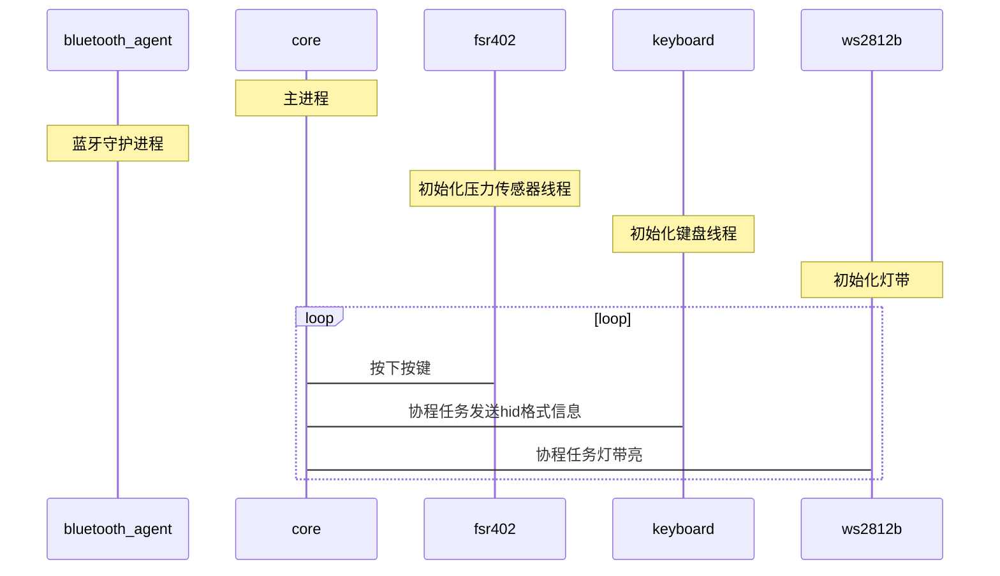

---
# try also 'default' to start simple
theme: seriph
# random image from a curated Unsplash collection by Anthony
# like them? see https://unsplash.com/collections/94734566/slidev
background: https://source.unsplash.com/collection/94734566/1920x1080
# apply any windi css classes to the current slide
class: 'text-center'
# https://sli.dev/custom/highlighters.html
highlighter: shiki
# show line numbers in code blocks
lineNumbers: false
# some information about the slides, markdown enabled
info: |
  ## Slidev Starter Template
  Presentation slides for developers.

  Learn more at [Sli.dev](https://sli.dev)
# persist drawings in exports and build
drawings:
  persist: false
# page transition
transition: slide-left
# use UnoCSS
css: unocss
layout: cover
---

# 电子木鱼

  
    Press Space for next page <carbon:arrow-right class="inline"/>
  

---
layout: two-cols
---
<template v-slot:default>

## 物料清单

|                   |     |
| ----------------- | --- |
| 树莓派4b          |     |
| 真实木鱼一个      |     |
| rfp402压力传感器  |     |
| pcf8591数模转换器 |     |
| ws2812b灯带       |     |

</template>
<template v-slot:right>

## 项目结构
 

<pre>
├── LICENSE
├── pyproject.toml
├── README.md
├── requirements.txt
├── run.sh
└── woodfish
    ├── main.py     # 主函数
    ├── core.py     # 核心代码
    ├── ble/        # 蓝牙代理
    ├── dac/        # 数模转换器
    ├── keyboard/   # 键盘
    ├── led/        # 灯带
    ├── press/      # 压力传感器
    ├── source/     # 资源文件
    ├── config.py   # 配置文件
    ├── content.py  # 文案
    └── test/       # 测试
</pre>

</template>
---

# 软件设计模式
 

## 订阅发布者模式

用于实现发布-订阅（Publish-Subscribe）机制。

存在两类角色：
     

        - 发布者（Publisher）
        - 订阅者（Subscriber）

- 发布者负责产生事件或消息，并将其发送到一个或多个订阅者。发布者通常不关心订阅者的身份和数量，只需将消息发布到合适的通道或主题（Topic）中。

- 订阅者则通过订阅（Subscribe）感兴趣的通道或主题，以接收发布者发送的消息。订阅者可以选择性地订阅特定的通道，也可以订阅所有发布者的消息。

---
transition: fade-out

level: 2
---

# 订阅发布者模式

- 我们的压力传感器扮演的是发布者(publisher)
- core核心调度扮演的是中间的管道
- 它将信息经过<code>数模转换器</code>传递到两个个订阅者 (subscriber)<code> ws2812b灯带 </code> <code> 蓝牙键盘</code>

---

# 蓝牙连接

 
 

- 我们将不使用树莓派提供的蓝牙服务器代理，因为这种方式需要确认蓝牙连接的pin码

- 借鉴了linux bluez蓝牙协议栈的代码，使用python构建了不需要pin码蓝牙服务器代理

- 通过蓝牙连接，我们可以将电子木鱼作为一个蓝牙键盘使用
- 蓝牙连接选择l2cap协议
- 树莓派监听 17 19 PSM端口
 

        - 17 PSM端口用于连接
        - 19 PSM端口用于键盘终端
---

# 蓝牙发送

 

- 我们使用linux 蓝牙伪装成hid蓝牙键盘
- 向主机发送hid码进行解析转化成键盘输入
- 英文原样保留 将汉字转换为拼音和空格的组合
- 再将他们转换成hid码进行发送
- 作为接受方的主机会认为是键盘输入来进行相应处理。
- 我们实际实现的效果是将压力传感器按压一次然后在电脑或手机上输出文案

---

# 并发操作

 

## 执行效率

对于io密集型任务，

- 进程切换的开销相对较大，
- 线程切换的开销较小，
- 而协程切换的开销更小。

## 平台和语言支持
 

- 由于python GIL全局解释锁的存在，python的多线程并不能实现真正的并发
- 所以我们使用了协程来实现并发操作。

---

---

# 遇到的问题
 

## 一开始我们使用单线程，蓝牙传输一个字都有很大的延迟

 

- 后来我们将蓝牙代理继承Process类实现进程
- 压力传感器继承Thread类实现线程
- 并使用协程管理调度，实现了并发操作

 

### 充分利用树莓派多核，实现了蓝牙，压力传感器，键盘
### 灯带的并发操作，降低了延迟
